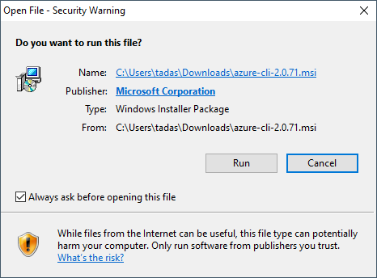
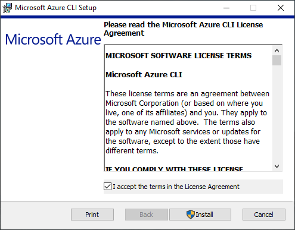
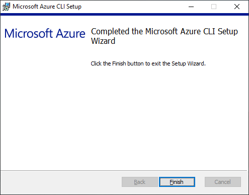
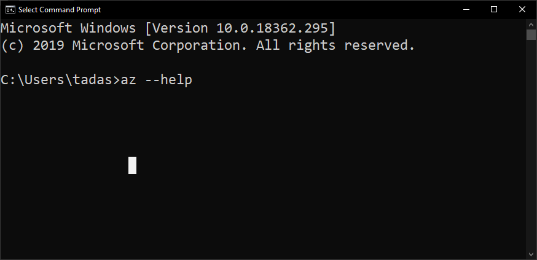

# Lab-1 Installing Azure CLI

In this lab you will go through the steps required to install the Azure CLI.

## Installing Azure CLI on Windows
1. Go to the following [URL](https://aka.ms/installazurecliwindows) this will automatically start downloading the 
installer required
2. Open the downloaded file, you will most likely see an image like this:

3. Click on *Run*
4. Accept the license agreement and click *Install*

5. Wait until the files are copied over and click *Finish*

6. Open *Command Prompt*
7. Let's check that the Azure CLI has been successfully installed by running the following command
`az --help` and press enter

8. If you got the help output the installation was successful, if you didn't get the help output ask your trainer for help
