# Lab-1 Installing Azure CLI

In this lab you will go through the steps required to install the Azure CLI.

## Installing Azure CLI on Windows
1. Go to the following [URL](https://aka.ms/installazurecliwindows) this will automatically start downloading the 
installer required
2. Open the downloaded file, you will most likely see an image like this:

3. Click on *Run*
4. Accept the license agreement and click *Install*

5. Wait until the files are copied over and click *Finish*

6. Open *Command Prompt*
7. Let's check that the Azure CLI has been successfully installed by running the following command
`az --help` and press enter

8. If you got the help output the installation was successful, if you didn't get the help output ask your trainer for help

## Installing Azure CLI on Linux
1. Open terminal
2. Run the following command `curl -sL https://aka.ms/InstallAzureCLIDeb | sudo bash`

3. You will most likely be asked to enter password, enter it
4. Once the installation has been completed run the following command to make sure installation was successful
`az --help`
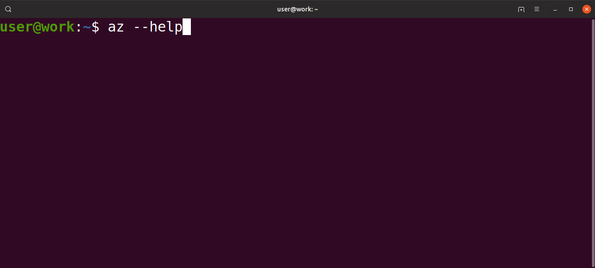
5. If you got the help output the installation was successful, if you didn't get the help output ask your trainer for help

## Summary

In this lab we have learned how to install Azure CLI on either Windows or Linux

# Lab-2 Connecting to Azure and using interactive mode

In this lab you will connect to the Azure services through the terminal and learn how to use the interactive mode.

1. Open a terminal
2. Execute the following command `az login`, your default browser will open up a Microsoft page
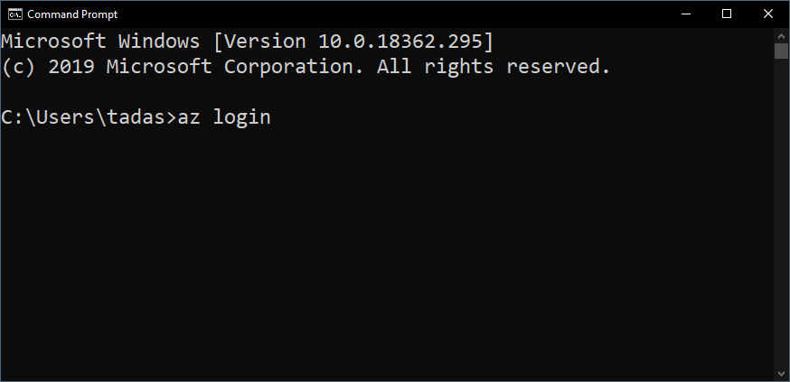
3. Enter the details for the Azure account you're using
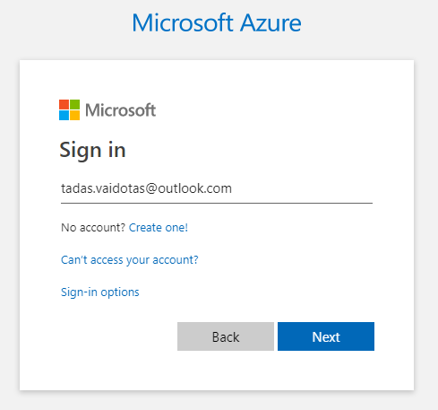
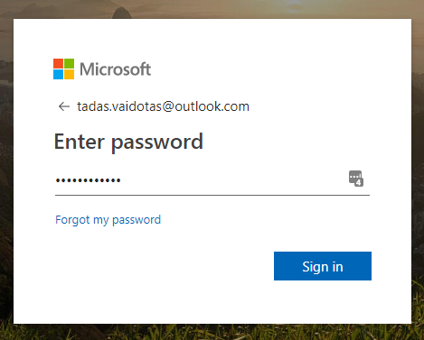
4. You will be redirected to the page that should say
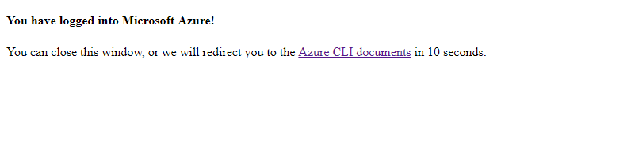
5. On the terminal you should see a similar output but with your details
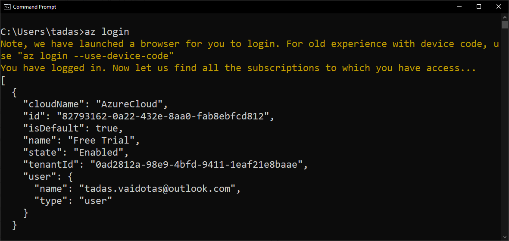
6. Execute the following command to invoke interactive CLI mode `az interactive` it will take a few minutes the first 
time you're using it to download and install all the requirements
7. You can choose to send or not to the telemetry data

8. After choosing your option about the telemetry data you will then be taken to the interactive CLI window
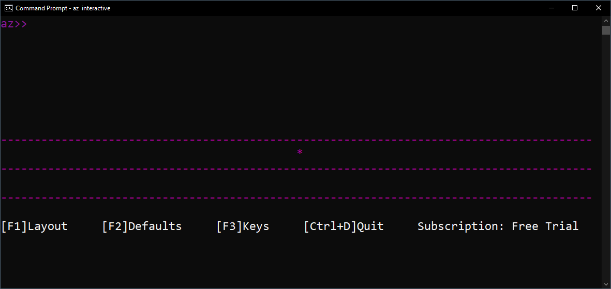
`az interactive` gives a couple of benefits like auto-completion, command descriptions and examples
9. Pick a style for the interactive mode from the available list by running the command `az interactive --style styleName`
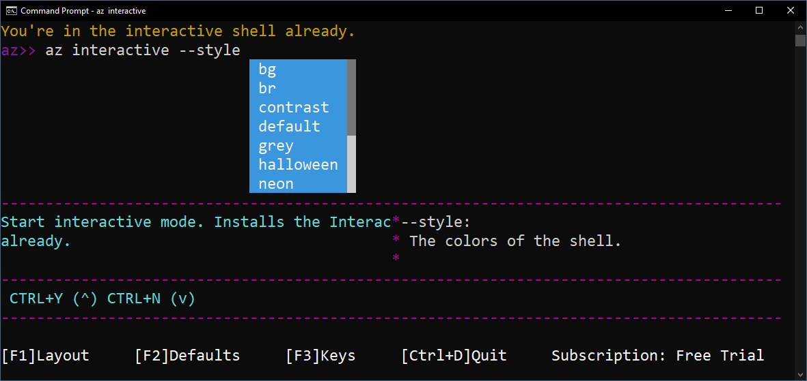
10. You can also execure shell commands by using `#`, let's list all the contents of the current directory by executing
`#dir` you should see the terminal display the contents

## Summary

In this lab you have learned how to log in to your Azure services through CLI, as well as how to start the CLI 
interactive mode

# Lab-3 Creating a VM through CLI

In this lab we'll be creating a Virtual Machine and other required resources through CLI

1. Open terminal
2. Log in
3. First we'll create a new resource group in the *ukwest* region by executing the following command
`az group create --name my-first-vm --location ukwest`
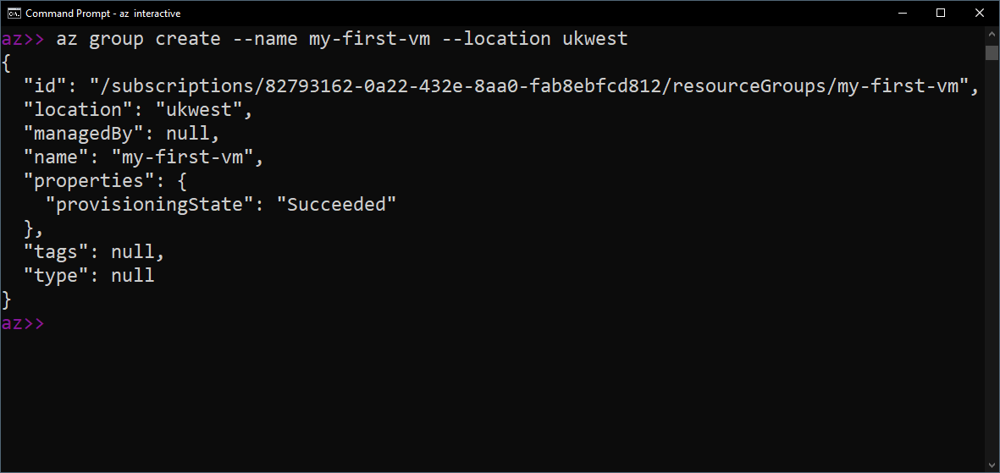
We can see that under the *properties -> provisioningState* the value is *Succeeded* this means that your resource
group has been successfully created
4. Now we'll create a VM within our created resource group, execute the following command to create a VM 
`az vm create --resource-group my-first-vm --name VM1 --image UbuntuLTS --generate-ssh-keys --output json --verbose`
Wait until the VM is created. If the terminal isn't returned back to you after a couple of minutes, try pressing enter.
This command will create a VM in the resource group `my-first-vm` the name of the VM will be `VM1` the image deployed as
the OS will be `UbuntuLTS` you will also generate an ssh key and expect the output about the creation process to be in
json format and with all the details. The ssh key will be used in order to connect to the `VM1`.
5. Once the `VM1` is created you will get some information about it, we are particularly interested in the `publicIpAddress`
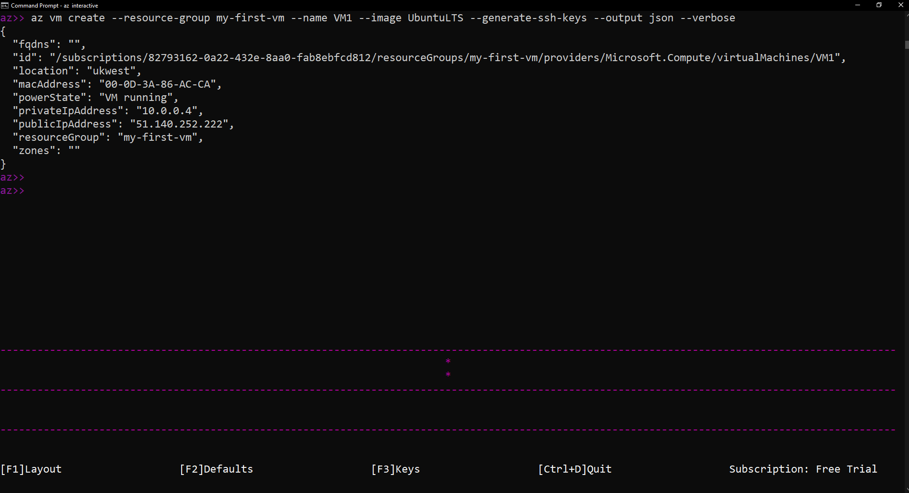
6. Now we'll connect to the `VM1` by using `SSH` and the public ip. But first type `exit` and hit enter, as within the 
interactive mode, we cannot use ssh. Execute the following command and insert your `VM1` public ip `ssh 51.140.252.222`.
When prompted about continuing the connection type `yes` and press enter.
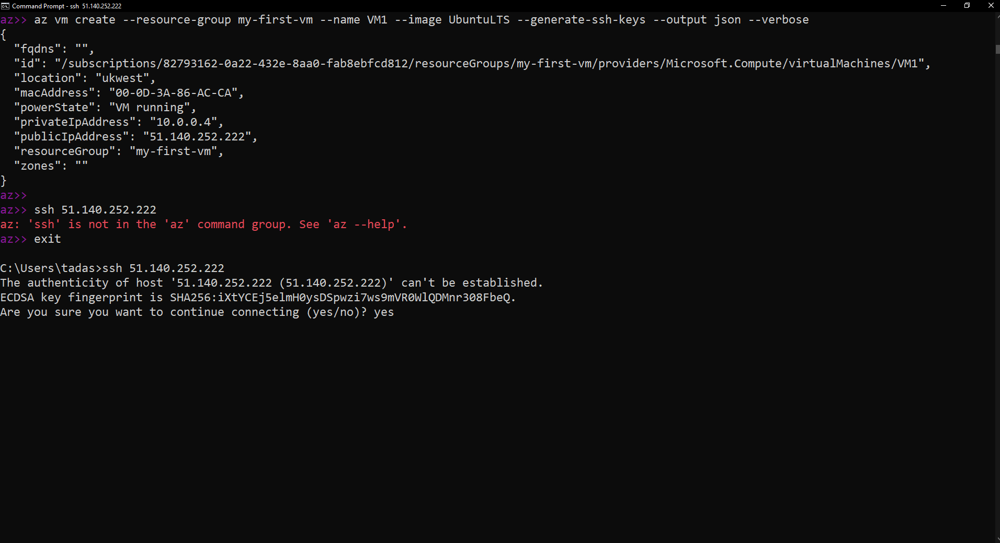
7. You will get a message about the IP address being added to the list of known hosts. 
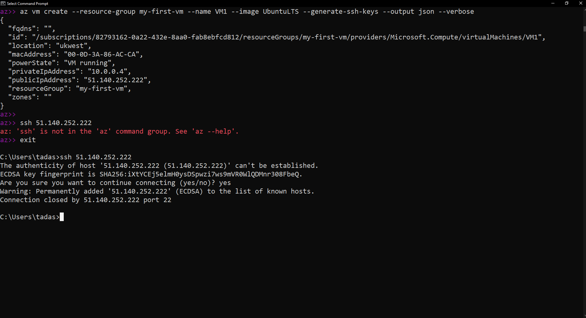
8. Run the `ssh 51.140.252.222` command again and you should then be connected to the `VM1`
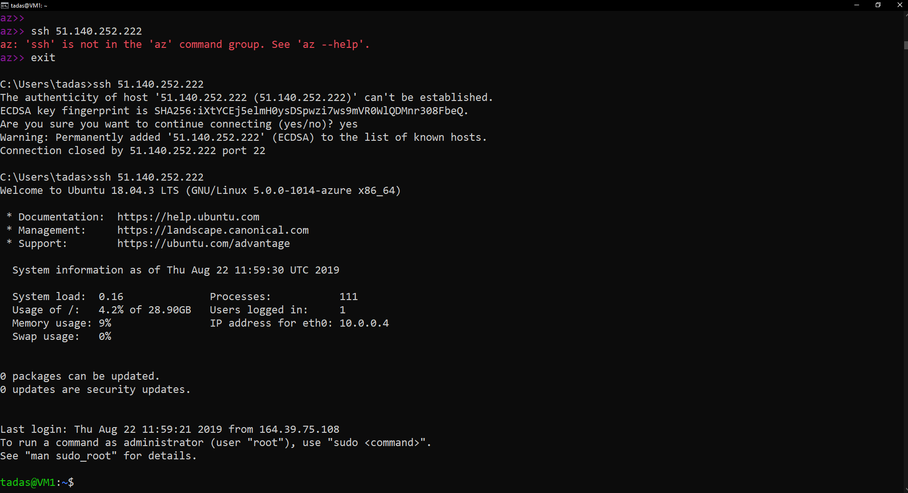
9. Notice that you got information about the `VM1` this means you have successfully connected. After making sure that 
the `VM` is running we will disconnect from the virtual machine. Type `exit` and press enter. You will get a message
about closing the connection.
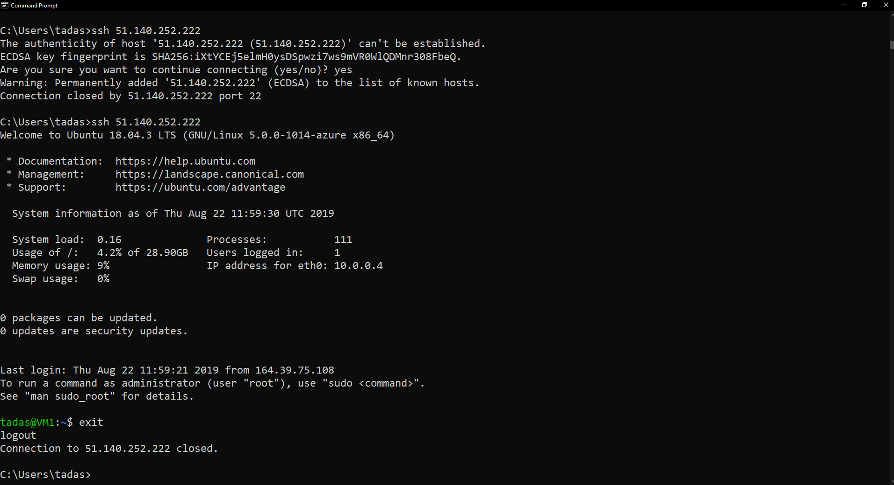
10. Invoke the interactive azure CLI again
11. You have seen that after creating the VM you receive information about it. But what if the VM has been running for 
a long time now? We will now use a command `show` which will allow you to get information about the VM. Execute the
following command `az vm show --name VM1 --ressource-group my-first-vm`. 
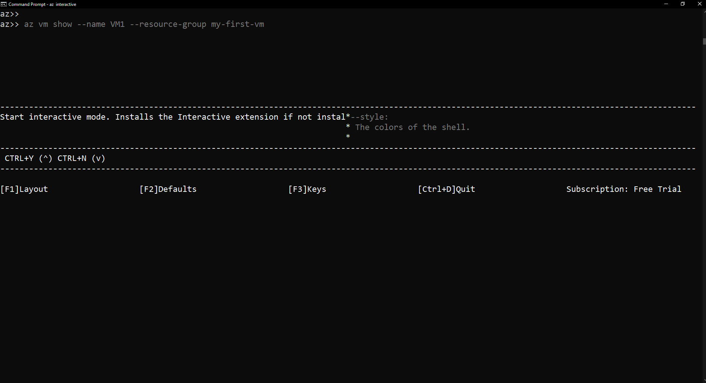
12. You will see that the amount of information we get about the VM is quite extensive. 
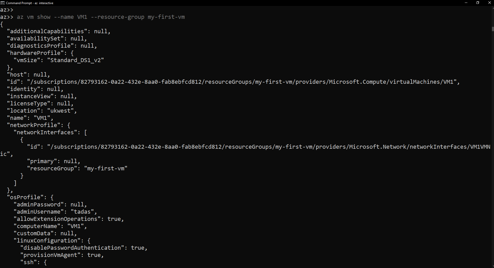
There is a way to simplify the output to the specific selected parts.
13. Let's say we want the name of the `VM1` the command to get it directly would be 
`az vm show --name VM1 --resource-group my-first-vm --query 'name' --output json`
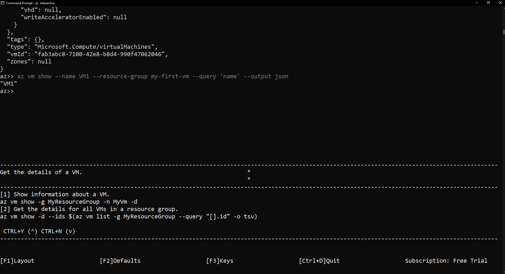
14. If you wanted to get the size of the disk space the command would be 
`az vm show --name VM1 --resource-group my-first-vm --query 'storageProfile.osDisk.diskSizeGb' --output json`
As you can notice we use fullstops to navigate into the child elements of the output. One thing to note is that
if the child element had [] it means it's an array, and we would need to flatten it by using [] as well to get the wanted 
value like in this command
`az vm show --name VM1 --resource-group my-first-vm --query 'networkProfile.networkInterfaces[].resourceGroup' --output json`
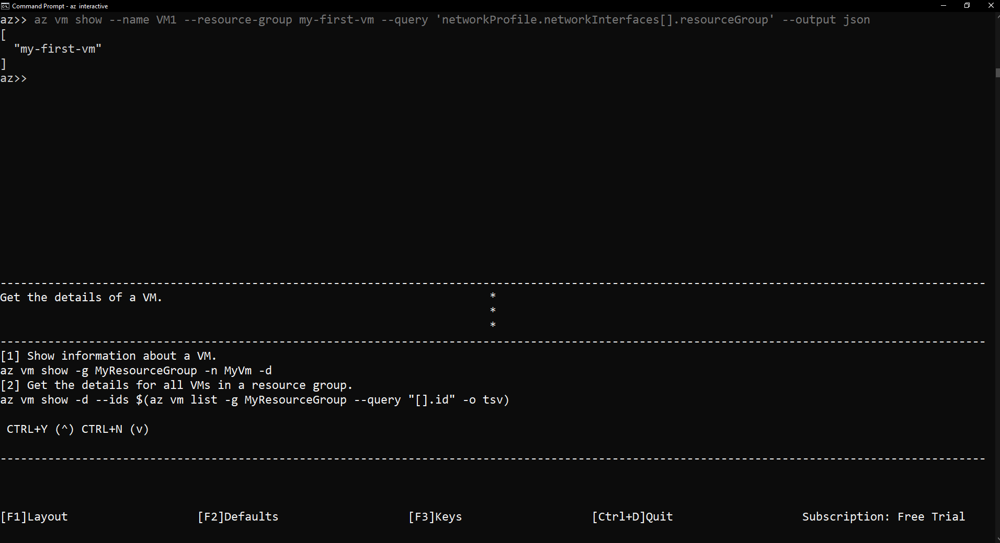
15. You can also simplify the commad to
`az vm show -n VM1 -g my-first-vm --query 'networkProfile.networkInterfaces[].resourceGroup' -o json`
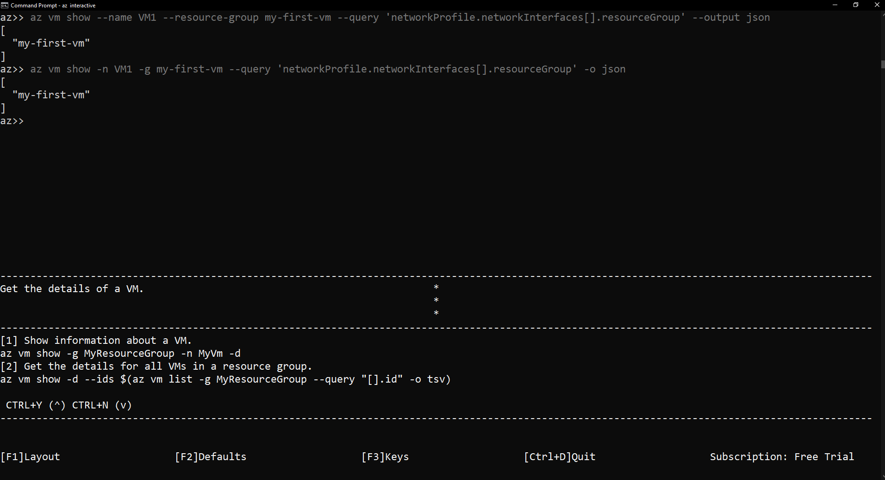
16. Before we can move on we need to get the ID for this VM's Network Interface Card, execute the following command and save this value
`az vm show -n VM1 -g my-first-vm --query 'networkProfile.networkInterfaces[].id' -o json`
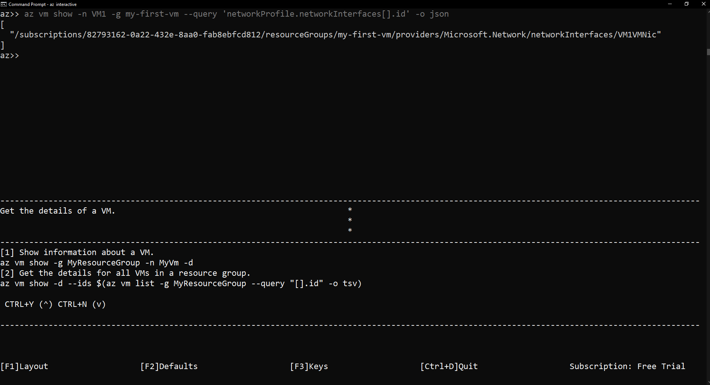
Save the value in a text file
17. By using the network interface card you will now try to retrieve the information about the `VM1`, execute the following
command but replace the value with the one you saved in the previous step
`az network nic show --ids "/subscriptions/82793162-0a22-432e-8aa0-fab8ebfcd812/resourceGroups/my-first-vm/providers/Microsoft.Network/networkInterfaces/VM1VMNic"`
Notice that once again there is a large amount of information returned. To find a specific peace, you would need to use
the `--query` to filter it down.
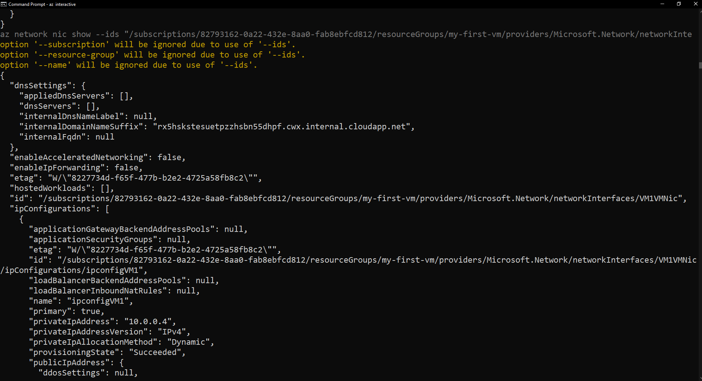
18. Now if your interests were in finding just the IP and Subnet executing the following command would produce the wanted result 
`az network nic show 
--ids "/subscriptions/82793162-0a22-432e-8aa0-fab8ebfcd812/resourceGroups/my-first-vm/providers/Microsoft.Network/networkInterfaces/VM1VMNic"
--query '{IP:ipConfigurations[].publicIpAddress.id, Subnet:ipConfigurations[].subnet.id}' -o json`
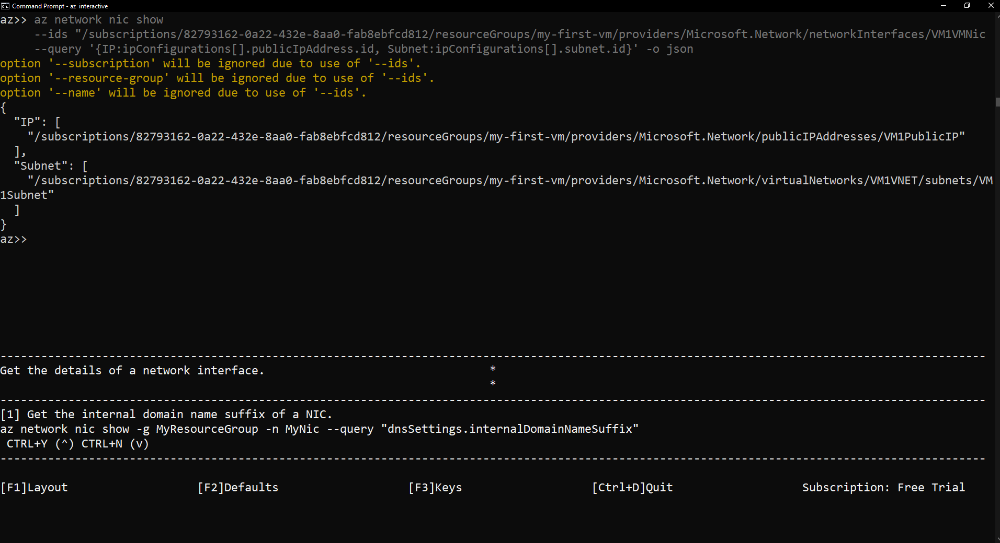
Save the value of `Subnet` you'll need it in the next step
19. You can now use the `Subnet` value to now create another VM within the same subnet as the existing VM we previously
created. Additional option needs to be added `--subenet` and a value provided. Another change is that now the VM creation
command has a `--query publicIpAddress` option added, this will only return the IP address for the newly created VM
instead of all the previously seen information.
`az vm create -g my-first-vm -n VM2 --image UbuntuLTS --generate-ssh-keys --subnet "/subscriptions/82793162-0a22-432e-8aa0-fab8ebfcd812/resourceGroups/my-first-vm/providers/Microsoft.Network/virtualNetworks/VM1VNET/subnets/VM1Subnet" --query publicIpAddress -o json`
20. To clean up delete all the resources under the resource group with the following command
`az group delete --name my-first-vm`
Agree yes to the prompt.
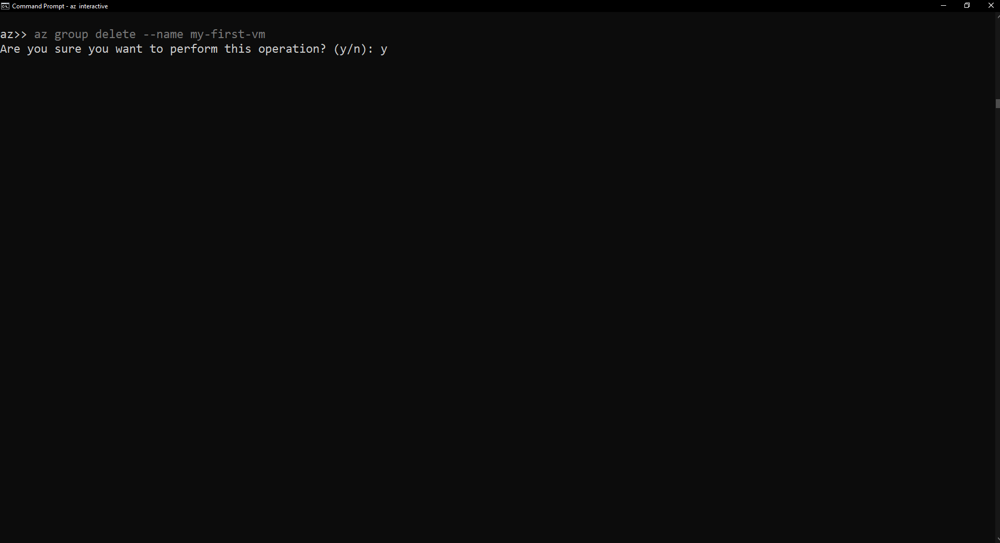

